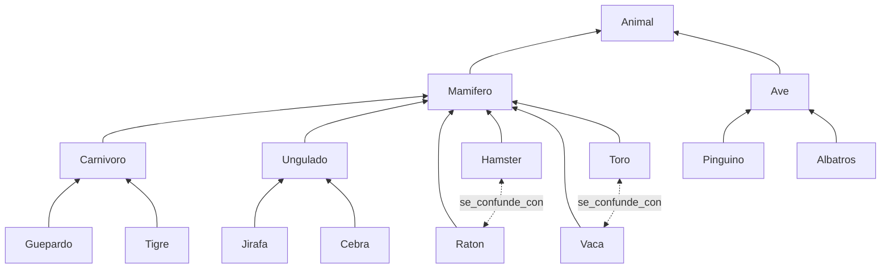

# Diagrama Animales

```mermaid
graph BT
    Mamifero --> Animal
    Ave --> Animal

    Carnivoro --> Mamifero
    Ungulado --> Mamifero
    Raton --> Mamifero
    Hamster --> Mamifero
    Vaca --> Mamifero
    Toro --> Mamifero

    Guepardo --> Carnivoro
    Tigre --> Carnivoro
    Jirafa --> Ungulado
    Cebra --> Ungulado

    Pinguino --> Ave
    Albatros --> Ave

    Raton <-.->|se_confunde_con| Hamster
    Vaca <-.->|se_confunde_con| Toro
```

# Descripcion
- **Cuadro** = clase
- **Flecha continua** = `es_un` (la clase de abajo es un tipo de la de arriba)
- **Flecha punteada de dos puntas** = `se_confunde_con`